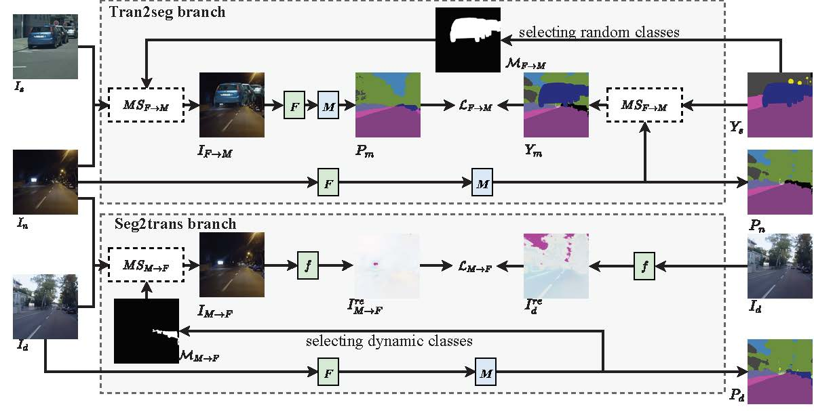
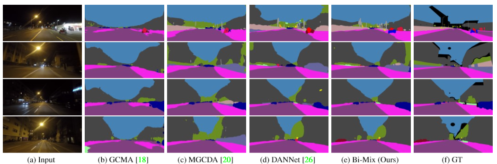

# BiMix
The code for Bi-Mix: Bidirectional Mixing for Domain Adaptive Nighttime Semantic Segmentation [arxiv]()

Framework:

visualization results: 


## Requirements
* scipy==1.2.2
* kornia
* scikit-image
## Datasets
**Cityscapes**: Please follow the instructions in [Cityscape](https://www.cityscapes-dataset.com/) to download the training set.

**Dark-Zurich**: Please follow the instructions in [Dark-Zurich](https://www.trace.ethz.ch/publications/2019/GCMA_UIoU/) to download the training/val/test set.

**Nightdriving**：Please follow the instructions in [Nightdriving](http://people.ee.ethz.ch/~daid/NightDriving/) to download the training/val/test set.
## Training 
If you want to train your own models, please follow these steps:
```
Step1: download the [pre-trained models](https://www.dropbox.com/s/3n1212kxuv82uua/pretrained_models.zip?dl=0) and put it in the root.
Step2: change the data and model paths in configs/train_config.py
Step3: run "python train.py"
```
## Evaluating

To reproduce the reported results in our paper (on Dark-Zurich val or Nightdriving), please follow these steps:
```
Step1: change the data and model paths in configs/evaluate_config.py
Step2: run "python eva_ep.py"
```

## Testing
To reproduce the reported results in our paper (on Dark-Zurich test), please follow these steps:
```
Step1: change the data and model paths in configs/test_config.py
Step2: run "python test.py"
```
To evaluate your methods on the test set, please visit this [challenge](https://competitions.codalab.org/competitions/23553) for more details.
## Acknowledgments
The code is based on [DANNet](https://github.com/W-zx-Y/DANNet) and [
Zero-DCE](https://github.com/Li-Chongyi/Zero-DCE).
## Related works
* [MGCDA](https://github.com/sakaridis/MGCDA)
* [GCMA](https://www.trace.ethz.ch/publications/2019/GCMA_UIoU/GCMA_UIoU-Sakaridis+Dai+Van_Gool-ICCV_19.pdf)
* [DANNet](https://github.com/W-zx-Y/DANNet)
* [AdaptSegNet](https://github.com/wasidennis/AdaptSegNet)
## Citation
If you think this paper is useful for your research, please cite our paper:
```
```
### Contact
* Guanglei Yang (yangguanglei@hit.edu.cn)
